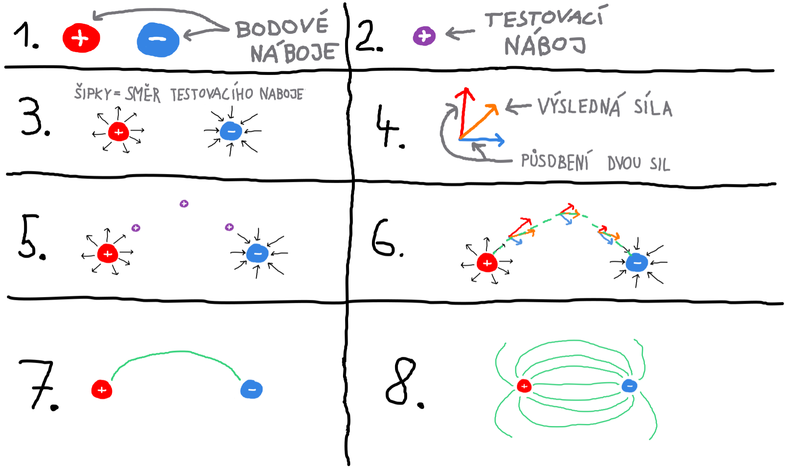

# Elektrotechnika skripty

## Abstrakt

## Obsah
- [Kontakt](#kontakt)
- [Úvod](#úvod)
- [Kapitoly](#kapitoly)
    - [Pojmy a veličiny](#kapitola-1---pojmy-a-veličiny)

## Kontakt
Pokud objevíte jakékoli chyby, nepřesné údaje, máte návrhy na vylepšení, nebo máte dotazy, neváhejte mě kontaktovat. Můžete tak učinit prostřednictvím záložky Issues na GitHubu nebo na e-mail uvedený níže. Vaše podněty mohou přispět k užitečné diskusi, která může být přínosná i pro ostatní čtenáře.

```
warezoid@proton.me
```

## Úvod


## Kapitoly

### Kapitola 1 - Pojmy a veličiny

#### Obsah kapitoly 1
- Obsah
    - [Síla](#síla)
    - [Energie a práce](#energie-a-práce)
    - [Elektrický náboj](#elektrický-náboj)
    - [Elektrický proud](#elektrický-proud)
    - [Elektrický odpor](#elektrický-odpor)
- [Zdroje kapitoly 1](#zdroje-kapitoly-1)

<hr>

#### Síla.
- **Značka: F**
- **Jednotky: newton (N)**
<br>
- Síla vyjadřuje míru vzájemného působení těles nebo polí.
- Projevuje se statickými a dynamickými účinky.
    - Statický účinek: deformace těles.
    - Dynamický účinek: změna pohybového stavu.
<hr>

#### Energie a práce.
- Práce je působení síly na těleso po určité dráze.
- Energií lze chápat jako schopnost vykonat práci. Nelze ji vytvořit ani zničit.
- Ve vztahu mezi energií a prací je práce stav a energie děj.

<hr>

#### Elektrický náboj.
- **Značka: Q**
- **Jednotky: coulomb (C), ampérsekunda (As), miliampérhodina (mAh)**
<br>
- Elektrický náboj je fyzikální vlastnost hmoty.
- Definicí coulombu je množství náboje, které je přeneseno proudem o velikosti 1 ampér za dobu 1 sekundy.

- Náboj může mít dvě polarity, pro které platí:
    - Stejné polarity se odpuzují.
    - Různé polarity se přitahují.
- V přírodě je elektrický náboj obvykle vyrovnaný (existuje stejný počet kladných a záporných nábojů), což zajišťuje elektrickou neutralitu. 

**Vztahy mezi jednotkami**

- Ampérhodina (Ah): 1 Ah = 3600 C
- Miliampérhodina (mAh): 0.001 Ah
<hr>

#### Elektrický proud.
- **Značka: I**
- **Jednotka: ampér (A)**
<br>
- Elektrický proud je souvislý pohyb nosičů elektrického náboje (elektrony nebo ionty), které projdou za 1 sekundu daným průřezem vodiče.
- Definicí ampéru je:
    - Pokud jsou 2 nakonečně dlouhé vodiče od sebe ve vzdálenosti 1 metr, tak se buď přitahují nebo odpuzují (podle nabití nábojů) silou 2.7E-7 N.
<hr>

#### Elektrický odpor.
- **Značka: R**
- **Jednotka: ohm (&#937;)**
<br>
- Elektrický odpor je schopnost materiálu bránit průchodu elektrického proudu.
- Převrácená hodnota elektrického odporu je elektrická vodivost.
- V důsledku srážek nosičů elektrického náboje s odporem vzniká odpadní teplo.

- Elektrický odpor se vzrůstající teplotou:
    - Ve vodičích roste.
    - V polovodičích klesá.

**Vztahy mezi jednotkami**

- &#937; = V / A
<hr>

#### Elektrické pole.
- Elektrické pole je oblast kolem nabitého tělesa nebo částice, ve které působí elektrická síla na jiná nabitá tělesa nebo částice.

**Obraz elektrického pole**
- Obraz elektrického pole je znázorněn pomocí siločar, které ukazují směr a charakter působení pole.

<br>

- Všechen náboj soustředěný v malé kuličce se nazývá bodový náboj.
- Testovací náboj je obvykle kladný elektrický náboj a jeho přítomnost je využívána k určení směru a velikosti elektrického pole.
- Testovací náboj nemá žádný vliv na elektrické pole.

<br>

- Šipky kolem bodového náboje určují směr, kterým se vydá testovací náboj.
- Čím blíže se testovací náboj nachází k bodovému náboji, tím větší je síla, kterou na něj elektrické pole působí.

<br>

- Mezi dvěma bodovými náboji působí na testovací náboj různé síly v závislosti na jeho poloze, přičemž má každá síla jinou velikost a směr.
- Výsledný směr je vypočítán součtem těchto sil.




#### Zdroje kapitoly 1
- [Youtube](https://youtube.com/)
    - [Názorná elektrotechnika](https://youtube.com/@nazornaelektrotechnika)
        - [Základy Elektrotechniky](https://youtube.com/playlist?list=PL3r1xGSQfP9TBwvTqYEf6E-L9duHQbnir)
- [Wikipedie](https://wikipedia.org)
    - [Síla](https://cs.wikipedia.org/wiki/S%C3%ADla)
    - [Práce](https://cs.wikipedia.org/wiki/Elektrick%C3%A1_pr%C3%A1ce)
    - [Elektrický náboj](https://cs.wikipedia.org/wiki/Elektrick%C3%BD_n%C3%A1boj)
    - [Nosič elektrického náboje](https://cs.wikipedia.org/wiki/Nosi%C4%8D_n%C3%A1boje)
    - [Elektrický proud](https://cs.wikipedia.org/wiki/Elektrick%C3%BD_proud)
    - [Elektrický odpor](https://cs.wikipedia.org/wiki/Elektrick%C3%BD_odpor)