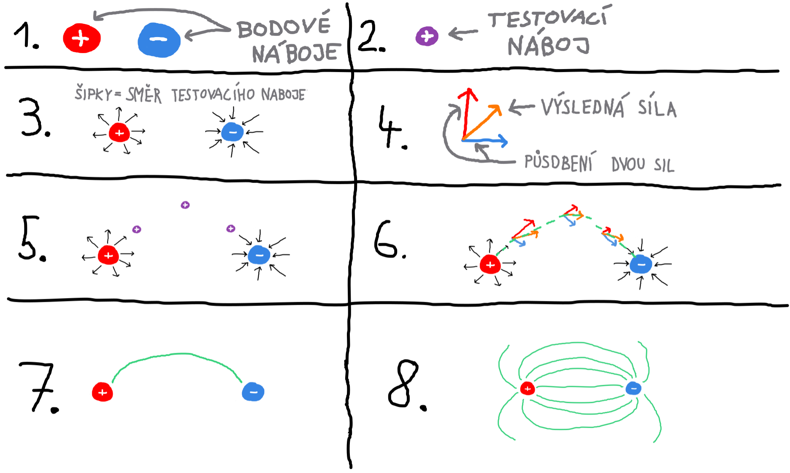
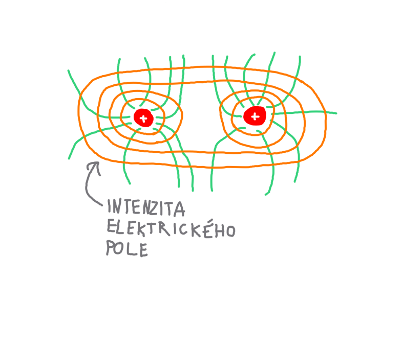

# Kapitola 1
Kapitola pojmy a veličiny popisuje základní fyzikální veličiny a pojmy, které je potřeba znát, při snaze o pochopení elektrotechniky.


## Obsah kapitoly
- Obsah
    - [Síla](#síla)
    - [Energie a práce](#energie-a-práce)
    - [Elektrický náboj](#elektrický-náboj)
    - [Elektrický proud](#elektrický-proud)
    - [Elektrický odpor](#elektrický-odpor)
    - [Elektrické pole](#elektrické-pole)
    - [Intenzita elektrického pole](#intenzita-elektrického-pole)
    - [Elektrický potenciál](#elektrický-potenciál)
    - [Elektrické napětí](#elektrické-napětí)
    - [Elektřina](#elektřina)
    - [Elektrická vodivost](#elektrická-vodivost)
    - [Úbytek napětí](#úbytek-napětí)
    - [Výkon](#výkon)
    - [Permitivita](#permitivita)
    - [Elektrická kapacita](#elektrická-kapacita)
    - [Indukční pole](#indukční-pole)
    - [Izolanty](#izolanty)
    - [Magnetismus a magnetické pole](#magnetismus-a-magnetické-pole)
- [Zdroje](#zdroje-kapitoly)


## Pojmy a veličiny

### Síla.
- **Značka: F**
- **Jednotky: newton (N)**

<br>

- Síla vyjadřuje míru vzájemného působení těles nebo polí.
- Projevuje se statickými a dynamickými účinky.
    - Statický účinek: deformace těles.
    - Dynamický účinek: změna pohybového stavu.
<hr>


### Energie a práce.
- Práce je působení síly na těleso po určité dráze.
- Energií lze chápat jako schopnost vykonat práci. Nelze ji vytvořit ani zničit.
- Ve vztahu mezi energií a prací je práce stav a energie děj.

<hr>


### Elektrický náboj.
- **Značka: Q**
- **Jednotky: coulomb (C), ampérsekunda (As), miliampérhodina (mAh)**

<br>

- Elektrický náboj je fyzikální vlastnost hmoty.
- Definicí coulombu je množství náboje, které je přeneseno proudem o velikosti 1 ampér za dobu 1 sekundy.

- Náboj může mít dvě polarity, pro které platí:
    - Stejné polarity se odpuzují.
    - Různé polarity se přitahují.
- V přírodě je elektrický náboj obvykle vyrovnaný (existuje stejný počet kladných a záporných nábojů), což zajišťuje elektrickou neutralitu. 

**Vztahy mezi jednotkami**

- Ampérhodina (Ah): 1 Ah = 3600 C
- Miliampérhodina (mAh): 0.001 Ah

<hr>


### Elektrický proud.
- **Značka: I**
- **Jednotka: ampér (A)**

<br>

- Elektrický proud je souvislý pohyb nosičů elektrického náboje (elektrony nebo ionty), které projdou za 1 sekundu daným průřezem vodiče.
- Definicí ampéru je:
    - Pokud jsou 2 nakonečně dlouhé vodiče od sebe ve vzdálenosti 1 metr, tak se buď přitahují nebo odpuzují (podle nabití nábojů) silou 2.7E-7 N.
- Kolem všech pohybujících se elektrických nábojů vzniká zároveň magnetické pole.

<hr>


### Elektrický odpor.
- **Značka: R**
- **Jednotka: ohm (&#937;)**

<br>

- Elektrický odpor je schopnost materiálu bránit průchodu elektrického proudu.
- Převrácená hodnota elektrického odporu je elektrická vodivost.
- V důsledku srážek nosičů elektrického náboje s odporem vzniká odpadní teplo.

- Elektrický odpor se vzrůstající teplotou:
    - Ve vodičích roste.
    - V polovodičích klesá.

**Vztahy mezi jednotkami**

- &#937; = V / A

<hr>


### Elektrické pole.
- Elektrické pole je oblast kolem nabitého tělesa nebo částice, ve které působí elektrická síla na jiná nabitá tělesa nebo částice.

**Obraz elektrického pole**
- Obraz elektrického pole je znázorněn pomocí siločar, které ukazují směr a charakter působení pole.
- Siločáry začínají a končí na elektrických nábojích různých polarit nebo vznikají na elektrickém náboji a pokračují do nekonečna.

<br>

- Všechen náboj soustředěný v malé kuličce se nazývá bodový náboj.
- Testovací náboj je obvykle kladný elektrický náboj a jeho přítomnost je využívána k určení směru a velikosti elektrického pole.
- Testovací náboj nemá žádný vliv na elektrické pole.

<br>

- Šipky kolem bodového náboje určují směr, kterým se vydá testovací náboj.
- Čím blíže se testovací náboj nachází k bodovému náboji, tím větší je síla, kterou na něj elektrické pole působí.

<br>

- Mezi dvěma bodovými náboji působí na testovací náboj různé síly v závislosti na jeho poloze, přičemž má každá síla jinou velikost a směr.
- Výsledný směr je vypočítán součtem těchto sil.



<hr>


### Intenzita elektrického pole.
- **Značka: E**
- **Jednotka: volt na metr (V/m), newton na coulomb (N/C)**

<br>

- Intenzita elektrického pole vyjadřuje velikost a směr elektrického pole, tudíž je to vektorová veličina.
- Lze ji chápat jako schopnost působit na elektrický náboj.
- Tato schopnost se projeví pouze pokud do pole vložíme elektrický náboj.
- Čím blíže jsme bodovému náboji, tím je intenzita elektrického pole větší, tím pádem bude na elektrický náboj působit větší síla.

**Obraz intenzity elektrického pole**
- Intenzitu elektrického pole lze zakreslit jako vrstevnice (ekvipotenciály), které jsou vždy kolmé na siločáry.
- Čím blíže jsou siločáry u sebe, tím bude působení elektrického pole větší. 



<hr>


### Elektrický potenciál.
- **Značka: φ**
- **Jednotka: volt (V)**

<br>

- Elektrický potenciál představuje množství práce potřebné k přenesení náboje z referenčního (počátečního) místa na dané místo v poli.
- Referenční místo, obvykle označované jako místo s nulovým potenciálem, je často vyjádřeno jako uzemnění nebo jiný bod, kde je potenciál definován jako nula.
- Popisuje potenciální (polohovou) energii elektrického náboje v elektrickém poli.
- Elektrický potenciál je skalární veličina. (nemá směr).

<hr>


### Elektrické napětí.
- **Značka: U**
- **Jednotka: volt (V)**

<br>

- Elektrické napětí je rozdíl dvou elektrických potencionálů v místech, kde se má vykonávat práce.
- Napětí může nabývat kladných nebo záporných hodnot, v závislosti na tom, zda se jedná o spotřebu nebo zdroj energie.
- Spotřeba (např. při pohybu nábojů) představuje samovolný pohyb nábojů, zatímco tlačení náboje proti intenzitě elektrického pole vyžaduje dodání napětí.
- Napětí je úzce svázáno s energií.

**Odvození voltu**
- Jednotka volt (V) není základní jednotkou v systému SI, a proto musí být odvozena z jiných základních jednotek SI.
- Následující vzorce ukazují princip odvození jednotky volt.

$$
\begin{align*}
V &= \frac{W}{A} \\
W &= \frac{J}{s} \\
J &= N \cdot m
\end{align*}
$$

- Kde:

```
V = volty (elektrické napětí)
W = watty (výkon)
A = ampéry (elektrický proud)
J = joule (energie)
s = sekundy (čas)
N = newton (síla)
m = metr (dráha)
```

<hr>


### Elektřina.
- Elektřina je souhrn projevů elektrického pole a elektrodynamických jevů.
- Je to vlastnost hmoty, která zahrnuje všechny jevy spojené s elektrickým nábojem a jeho interakcí s elektrickým a magnetickým polem.

<hr>


### Elektrická vodivost.
- **Značka: G**
- **Jednotka: siemens (S)**

<br>

- Hodnota elektrické vodivosti závisí na vlastnostech materiálu, průřezu vodiče, jeho délce a teplotě.
- Elektrická vodivost je definována jako převrácená hodnota elektrického odporu.

<hr>


### Úbytek napětí.
- **Značka: ΔU**
- **Jednotka: volt (V)**

<br>

- Úbytek napětí je jev v elektrickém obvodu, kdy dochází ke ztrátě části napětí na spotřebiči nebo odporu.
- Ztráta napětí znamená vykonání práce, při které se elektrická energie mění na teplo.
- Teplo vzniká tím, že se elektrony nesoucí náboj sráží s atomy materiálu, například s atomy mědi. Tím se atomy rozkmitají a jejich pohybem vzniká teplo.
- Úbytek napětí je dán Ohmovým zákonem, a proto platí:

$$
\Delta U = I \cdot R
$$

- Tím pádem platí že:
    - Vyšší napětí umožňuje vykonat stejné množství práce při nižším elektrickém proudu, což vede k menším ztrátám.

<hr>


### Výkon.
- **Značka: P**
- **Jednotka: watt (W)**

<br>

- Výkon vyjadřuje množství práce za jednotku času.
- Výkon v elektrickém obvodu vypočteme jako součin elektrického napětí a proudu.

$$
P = U \cdot I
$$

- Pokud vynásobíme elektrický proud úbytkem napětí na odporové složce obvodu, získáme ztráty, neboli ztrátové teplo.

$$
\Delta P = \Delta U \cdot I
$$

**Odvození wattu**
- Jednotka watt (W) není základní jednotkou v systému SI, a proto musí být odvozena z jiných základních jednotek SI.
- Následující vzorce ukazují princip odvození jednotky watt.

$$
\begin{align*}
W &= \frac{J}{s} \\
J &= N \cdot m
\end{align*}
$$

- Kde:

```
W = watty (výkon)
J = joule (energie)
s = sekundy (čas)
N = newton (síla)
m = metr (dráha)
```

<hr>


### Permitivita.
- **Značka: ε**
- **Jednotka: farad na metr (F/m)**

<br>

- Vyjadřuje míru odporu při vytváření elektrického pole v určitém materiálu.
- Permitivitu materiálu vypočteme jako součin permitivity vakua a relativní permitivity.
- Relativní permitivita je poměrná hodnota vůči permitivitě vakua.

$$
\varepsilon = \varepsilon_0 \cdot \varepsilon_r
$$

- Značku permitivity vakua a její hodnotu naleznete níže:

$$
\varepsilon_0 = 8.854 \cdot 10^{-12} \, \mathrm{F/m}
$$

<hr>


### Elektrická kapacita.
- **Značka: C**
- **Jednotka: farad (F)**

<br>

- Elektrická kapacita vyjadřuje schopnost [kondenzátoru](./kapitola_3.md#kondenzátor) nebo soustavy vodičů uchovávat elektrický náboj.
- Vyjadřuje vztah mezi elektrickým napětím a elektrickým nábojem.
- Kapacitu lze vypočítat podle následujícího vzorce:

$$
C = \frac{Q}{U}
$$

- Kde:

```
C = elektrická kapacita (farad)
Q = elektrický náboj (coulomb)
U = napětí (volt)
```

- U kondenzátoru s deskami můžeme kapacitu odvodit z následujícího vzorce:

$$
C = \frac{S \cdot ε}{d}
$$

- Kde:

```
C = elektrická kapacita (farad)
S = obsah (plocha) desek kondenzátoru (m²)
ε = permitivita prostředí mezi deskami (F/m)
d = vzdálenost mezi deskami (m)
```

<hr>


### Indukční pole.
- **Značka: D**
- **Jednotka: coulomb na metr čtvereční (C/m²)**

<br>

- Elektrická indukce (indukční pole) je veličina charakterizující elektrické pole, která bere v úvahu vliv volných nábojů bez vlivu vázaných nábojů v dielektriku.
- Vázané náboje vznikají polarizací dielektrika, kdy vlivem vnějšího elektrického pole dochází k vytvoření dipólů.
- Dipól je útvar, kde dochází k oddělení kladného a záporného náboje v rámci molekul nebo atomů.
- Elektrickou indukci lze vypočítat podle vzorce:

$$
D = E \cdot ε
$$

```
D = vektor elektrické indukce (C/m²)
E = intenzita elektrického pole (V/m)
ε = permitivita prostředí (F/m)
```

<hr>


### Izolanty.
- Izolant je látka, která neobsahuje volné nosiče elektrického náboje, tudíž jsou elektricky nevodivé.
- Izolanty lze nazývat dielektriky, ovšem tato dvě slova nejsou synonyma.
- Každý izolant má limit voltů, které je schopný udržet.
- Dielektrikum je typ izolantu, který je použit v kontextu elektrického pole a má schopnost se polarizovat, což ovlivňuje kapacitu a chování pole.
- Vakuum neobsahuje žádné částice a proto je jediný izolant, který není dielektrikem.

<br>

- Atomy nebo molekuly schopné přenášet elektrický náboj vznikají tím, že jim přibude nebo ubude elektron. Tím vznikají ionty.
- Roztoky obsahující ionty se nazývají elektrolyty.
- Například destilovaná voda je elektricky nevodivá, tedy funguje jako dielektrikum.
- Minerální voda však obsahuje minerály, které jsou schopny přenášet elektrický náboj.

<br>

**Polarizace dielektrika**
- Polarizace dielektrika je proces, při kterém se elektricky neutrální částice vloží do elektrického pole, což ovlivňuje jejich chování.
- Elektrický dipól vzniká tehdy, když je v molekule nerovnoměrně rozložen náboj, například kvůli nerovnoměrnému rozložení elektronové hustoty, aniž by to mělo vliv na celkovou elektrickou neutralitu molekuly.

<br>

- Díky polarizaci dielektrika vznikne na jedné straně pole převaha záporného náboje a na druhé straně převaha kladného náboje.
- Tento proces závisí na materiálu a jeho permitivitě, což určuje, jak silně se molekuly natočí a jaké výsledné elektrické pole vznikne.

<br>

- Typickým příkladem dipólu jsou molekuly, které je mohou tvořit. Například molekula vody:
    - Molekula vody je tvořena jedním atomem kyslíku a dvěma atomy vodíku.
    - Kyslík má vyšší elektronegativitu než vodík, což znamená, že více přitahuje elektrony.
    - Tato nerovnoměrná distribuce elektronů mezi kyslíkem a vodíkem vytváří dipól, kde je více záporného náboje soustředěno na kyslíku a více kladného náboje na vodíku.
    - Molekula vody je tak přirozeným dipólem, který je citlivý na vnější elektrická pole.


<br>

- Existují dva hlavní způsoby, jak může polarizace dielektrika probíhat:
    - Natočení dipólů v molekulách:
        - V molekulách, jako je voda, se atomy natáčí v souladu s elektrickým polem, podle pravidla protiklady se přitahují.
        - Tento jev nastává, když molekula již obsahuje stálý dipól, jako v případě molekuly vody.
    
    - Deformace drah elektronů:
        - V jednoduchých atomech, které nejsou dipóly (například atom vodíku), jsou dráhy elektronů symetrické.
        - Když se takový atom vloží do elektrického pole, dráhy elektronů se deformují směrem ke kladně nabité desce, čímž vzniká indukovaný dipól.

<hr>


### Magnetismus a magnetické pole.
- Hmota má několik vlastností, jako například hmotnost, náboj nebo spin.
- Spin uplatňujeme především ve kvantové fyzice, a je to vlastnost, kterou má každá elementární částice.
- Spin je malé magnetické pole, kolem každé částice, ale u protonu je jeho velikost zanedbatelná, proto nijak neovlivňuje výsledné magnetické pole.
- Výsledné magnetické pole kolem atomu je tvořeno velikostí spinu a pohybem elektronu kolem protonu.

<br>

- Pro většinu látek platí:
    - Elektrony se pohybují kolem jádra (protony a neutrony) po několika orbitalách. 
    - Jejich pohybem po několika orbitalách se magnetické pole vzniklé pohybujícími se elektrony vyruší.
    - Na každé orbitale můžou být pouze elektrony opačného spinu tím se vyruší magnetické pole na stejných orbitalách.

<br>

- Ne všechny látky, s magnetickým polem musí být magnetické. (tj. reagovat na magnet)
- Aby byla látka magnetická nesmí magnetické pole jednotlivých atomů ukazovat všemi směry.
- Skupinu atomů se stejným směrem magnetického pole lze nazvat doménou.
- Domény mohou ukazovat různými směry ovšem pod působením silnějšího magnetického pole se domény usměrní a ukazují stejným směrem. Tím vzniknou pernamentní magnety a zesílí se magnetické pole.
- Magnetické materiály, které po odstranění z magnetického pole ztrácejí své magnetické vlastnosti, se nazývají magneticky měkké oceli.
- Materiály, které i po vyjmutí z magnetického pole zůstávají magnetické, označujeme jako magneticky tvrdé oceli.
- Některé materiály se po vložení do magnetického pole zmagnetizují, ale s opačnou polaritou než má původní pole, což vede k oslabení magnetického pole.

<br>

- Speciální teorie relativity umožňuje chápat vzájemné působení elektrických nábojů jako relativní pohled na magnetické působení elektrického náboje na pohybující se elektrický proud.
- Magnetické pole vzniká v okolí pohybujících se elektronů, tedy v přítomnosti elektrického proudu.
- Magnetické pole je, stejně jako elektrické pole, znázorňováno siločárami. Čím blíže jsou siločáry u sebe, tím je magnetické pole silnější.
- Na rozdíl od elektrických siločar jsou magnetické siločáry uzavřené.
- Siločáry magnetického pole směřují ze severního pólu magnetu k jižnímu pólu. Na základě toho lze definovat:
    - Severní pól je místo, odkud siločáry vystupují.
    - Jižní pól je místo, kam siločáry vstupují.
- Přirozené magnetické pole je homogenní, což znamená, že jeho intenzita je všude stejná.
- Siločáry mají tendenci ve vertikálním směru zkracovat své trajektorie a v horizontálním směru se navzájem odpuzovat.
- Póly opačné polarity se přitahují, zatímco stejné polarity se odpuzují.


## Zdroje kapitoly
- [Youtube](https://youtube.com/)
    - [Názorná elektrotechnika](https://youtube.com/@nazornaelektrotechnika)
        - [Základy Elektrotechniky](https://youtube.com/playlist?list=PL3r1xGSQfP9TBwvTqYEf6E-L9duHQbnir)
- [Wikipedie](https://wikipedia.org)
    - [Síla](https://cs.wikipedia.org/wiki/S%C3%ADla)
    - [Práce](https://cs.wikipedia.org/wiki/Elektrick%C3%A1_pr%C3%A1ce)
    - [Elektrický náboj](https://cs.wikipedia.org/wiki/Elektrick%C3%BD_n%C3%A1boj)
    - [Nosič elektrického náboje](https://cs.wikipedia.org/wiki/Nosi%C4%8D_n%C3%A1boje)
    - [Elektrický proud](https://cs.wikipedia.org/wiki/Elektrick%C3%BD_proud)
    - [Elektrický odpor](https://cs.wikipedia.org/wiki/Elektrick%C3%BD_odpor)
    - [Elektrický potenciál](https://cs.wikipedia.org/wiki/Elektrick%C3%BD_potenci%C3%A1l)
    - [Elektrické napětí](https://cs.wikipedia.org/wiki/Elektrick%C3%A9_nap%C4%9Bt%C3%AD)
    - [Elektřina](https://cs.wikipedia.org/wiki/Elekt%C5%99ina)
    - [Elektrická vodivost](https://cs.wikipedia.org/wiki/Elektrick%C3%A1_vodivost)
    - [Výkon](https://cs.wikipedia.org/wiki/V%C3%BDkon)
    - [Permitivita](https://cs.wikipedia.org/wiki/Permitivita)
    - [Elektrická kapacita](https://cs.wikipedia.org/wiki/Elektrick%C3%A1_kapacita)
    - [Elektrická indukce](https://cs.wikipedia.org/wiki/Elektrick%C3%A1_indukce)
    - [Dielektrikum](https://cs.wikipedia.org/wiki/Dielektrikum)