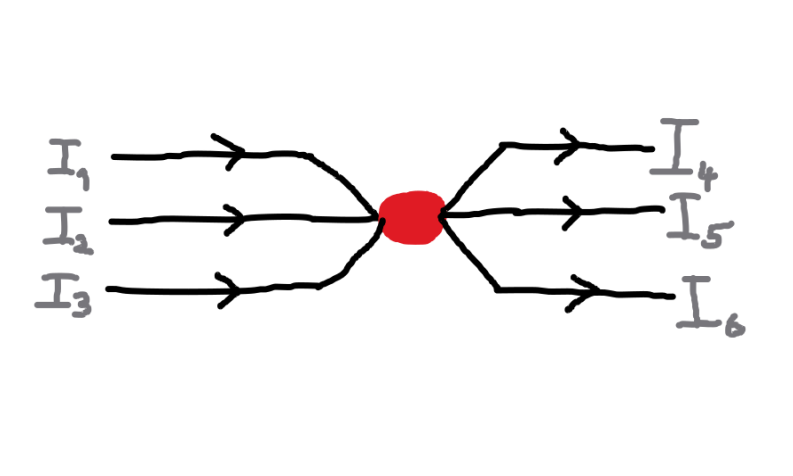
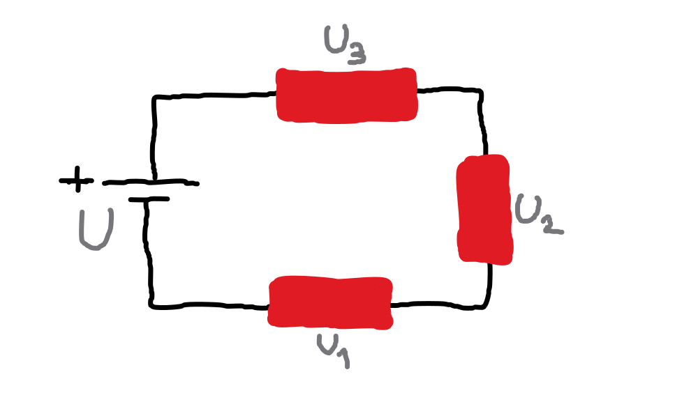
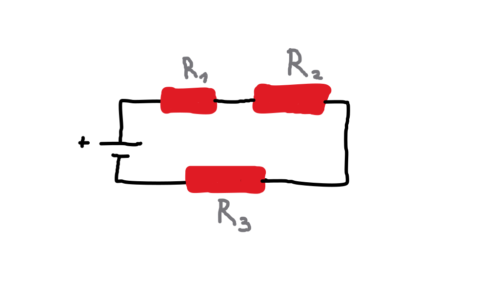
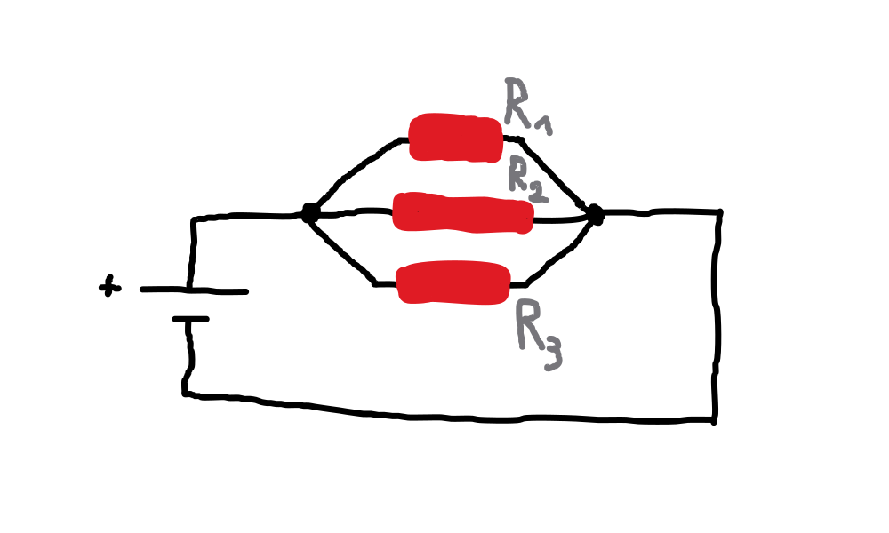

# Kapitola 2
Druhá kapitola popisuje základní fyzikální zákony, které vysvětlují vztahy mezi fyzikálními veličinami, jejich chováním a další zákonitosti elektrických obvodů.


## Obsah kapitoly
- Obsah
    - [Ohmův zákon](#ohmův-zákon)
    - [Columbův zákon](#columbův-zákon)
    - [Kirchhoffovy zákony](#kirchhoffovy-zákony)
        - [První Kirchhoffův zákon](#první-kirchhoffův-zákon)
        - [Druhý Kirchhoffův zákon](#druhý-kirchhoffův-zákon)
    - [Zapojení odporů](#zapojení-odporů)
        - [Sériové zapojení odporů](#sériové-zapojení-odporů)
        - [Paralelní zapojení odporů](#paralelní-zapojení-odporů)
- [Zdroje kapitoly](#zdroje-kapitoly)


## Zákony

### Ohmův zákon.
- Ohmův zákon vyjadřuje vztah mezi elektrickým napětím, proudem a odporem.

**Vzorec**

$$
U = I \cdot R
$$

kde: 

```
U = elektrické napětí
I = elektrický proud
R = elektrický odpor
```

<hr>


### Columbův zákon.
- Columbův zákon popisuje síly působící mezi nabitými elektrickými náboji.

**Vzorec**

$$
F = k \cdot \frac{Q_1 \cdot Q_2}{r^2}
$$

kde: 

```
F = výsledná síla
Q = velikost na sebe působících elektrických nábojů
r = vzdálenost mezi elektrickými náboji
k = konstanta úměrnosti
```

**Konstanta úměrnosti**

$$
k = \frac{1}{4 \cdot \pi \cdot \eta_0}
$$

- $\eta_0$ je v tomto případě permitivita vákua.

<hr>


### Kirchhoffovy zákony.
- Kirchhoffovy zákony popisují chování elektrického náboje a energie v elektrických obvodech.
- Slouží k analýze elektrických obvodů.

#### První Kirchhoffův zákon.
- Součet proudů vstupujících do uzlu se rovná součtu proudů vystupujících z uzlu.
- Elektrický náboj, tedy tok nábojů (elektrický proud), se nemůže nikam ztratit.



- Pro výše uvedený obrázek platí:

$$
I_1 + I_2 + I_3 = I_4 + I_5 + I_6
$$

#### Druhý Kirchhoffův zákon.
- V uzavřeném obvodu je součet napětí na zdrojích roven součtu úbytků napětí na spotřebičích.
- Elektrický obvod si vezme tolik napětí, kolik mu zdroj poskytne.



- Pro výše uvedený obrázek platí:

$$
U = U_1 + U_2 + U_3
$$

<hr>


### Zapojení odporů.

#### Sériové zapojení odporů.
- Odporové prvky jsou zapojeny za sebou na jednom vodiči.
- Všemi odpory protéká stejný elektrický proud, přičemž se napětí rozdělí mezi jednotlivé odpory.
- Celkový odpor obvodu je dán součtem všech jednotlivých odporů.

<br>

- Níže je uvedený příklad sériového zapojení odporů.



- Pro výpočet celkového odporu v elektrickém obvodu platí vztah:

$$
R = R_1 + R_2 + R_3
$$

#### Paralelní zapojení odporů.
- Jednotlivé odpory jsou zapojeny na různých větvích obvodu.
- S přibývajícími větvemi celkový odpor klesá, protože vzniká více cest, kudy může elektrický proud procházet.
- Převrácená hodnota celkového odporu se rovná součtu převrácených hodnot jednotlivých odporů.
- Převrácenou hodnotou odporu je elektrická vodivost.

<br>

- Níže je uvedený příklad paralelního zapojení odporů.



- Pro výpočet celkového odporu v elektrickém obvodu platí vztah:

$$
\frac{1}{R} = \frac{1}{R_1} + \frac{1}{R_2} + \frac{1}{R_3}
$$


## Zdroje kapitoly
- [Youtube](https://youtube.com/)
    - [Názorná elektrotechnika](https://youtube.com/@nazornaelektrotechnika)
        - [Základy Elektrotechniky](https://youtube.com/playlist?list=PL3r1xGSQfP9TBwvTqYEf6E-L9duHQbnir)
- [Wikipedie](https://wikipedia.org)
    - [Columbův zákon](https://cs.wikipedia.org/wiki/Coulomb%C5%AFv_z%C3%A1kon)
    - [Kirchhoffovy zákony](https://cs.wikipedia.org/wiki/Kirchhoffovy_z%C3%A1kony)