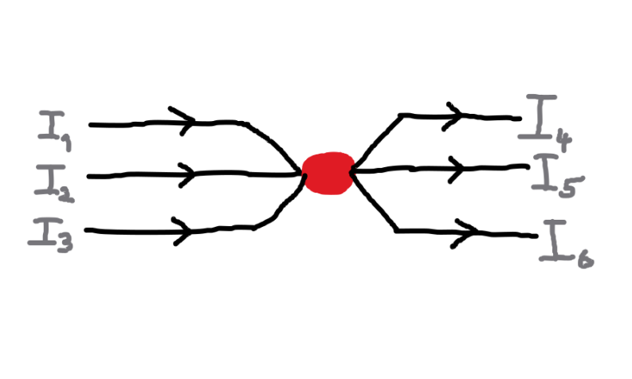
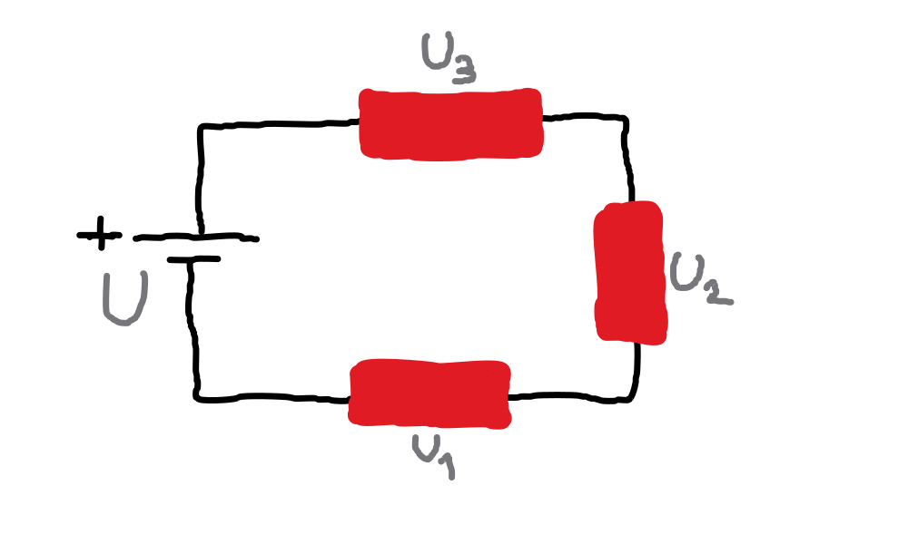

<div style="display: flex; width: 100vw; justify-content: space-between;">
  <a href="../kapitola_1/podkapitola_3.md"><< Magnetismus</a>
  <a href="./podkapitola_2.md">Zapojení odporů >></a>
</div>


# Zákonitosti a vztahy - Základní zákony
Druhá kapitola se zaměřuje na základní fyzikální vztahy a zákonitosti, které vysvětlují interakce mezi fyzikálními veličinami, jejich chováním a dalšími principy elektrotechniky a magnetismu. V rámci této podkapitoly se konkrétně soustředíme na základní zákony elektrotechniky a magnetismu.


## Obsah kapitoly
- Obsah
    - [Ohmův zákon](#ohmův-zákon)
    - [Columbův zákon](#columbův-zákon)
    - [Kirchhoffovy zákony](#kirchhoffovy-zákony)
        - [První Kirchhoffův zákon](#první-kirchhoffův-zákon)
        - [Druhý Kirchhoffův zákon](#druhý-kirchhoffův-zákon)
- [Zdroje kapitoly](#zdroje-kapitoly)


## Základní zákony


### Ohmův zákon
- Ohmův zákon vyjadřuje vztah mezi elektrickým napětím, proudem a odporem.

<br>

**Vzorec**

$$
U = I \cdot R
$$

kde: 

```
U = elektrické napětí
I = elektrický proud
R = elektrický odpor
```

---


### Columbův zákon
- Columbův zákon popisuje síly působící mezi nabitými elektrickými náboji.

<br>

**Vzorec**

$$
F = k \cdot \frac{Q_1 \cdot Q_2}{r^2}
$$

kde: 

```
F = výsledná síla
Q = velikost na sebe působících elektrických nábojů
r = vzdálenost mezi elektrickými náboji
k = konstanta úměrnosti
```

<br>

**Konstanta úměrnosti**

$$
k = \frac{1}{4 \cdot \pi \cdot \eta_0}
$$

- $\eta_0$ je v tomto případě permitivita vákua.

---


### Kirchhoffovy zákony
- Kirchhoffovy zákony popisují chování elektrického náboje a energie v elektrických obvodech.
- Slouží k analýze elektrických obvodů.


#### První Kirchhoffův zákon
- Součet proudů vstupujících do uzlu se rovná součtu proudů vystupujících z uzlu.
- Elektrický náboj, tedy tok nábojů (elektrický proud), se nemůže nikam ztratit.



- Pro výše uvedený obrázek platí:

$$
I_1 + I_2 + I_3 = I_4 + I_5 + I_6
$$


#### Druhý Kirchhoffův zákon
- V uzavřeném obvodu je součet napětí na zdrojích roven součtu úbytků napětí na spotřebičích.
- Elektrický obvod si vezme tolik napětí, kolik mu zdroj poskytne.



- Pro výše uvedený obrázek platí:

$$
U = U_1 + U_2 + U_3
$$

---


## Zdroje kapitoly
- [Youtube](https://youtube.com/)
    - [Názorná elektrotechnika](https://youtube.com/@nazornaelektrotechnika)
        - [Základy Elektrotechniky](https://youtube.com/playlist?list=PL3r1xGSQfP9TBwvTqYEf6E-L9duHQbnir)
    - [ElectroBOOM](https://www.youtube.com/@ElectroBOOM)

- [ChatGPT](https://chatgpt.com/)

- [Wikipedie](https://wikipedia.org)
    - [Columbův zákon](https://cs.wikipedia.org/wiki/Coulomb%C5%AFv_z%C3%A1kon)
    - [Kirchhoffovy zákony](https://cs.wikipedia.org/wiki/Kirchhoffovy_z%C3%A1kony)