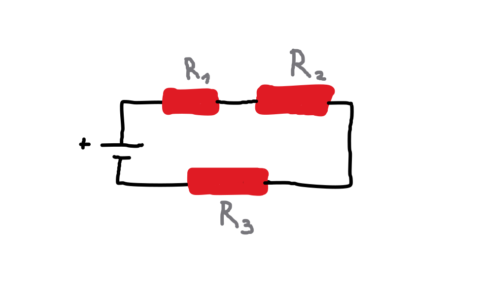
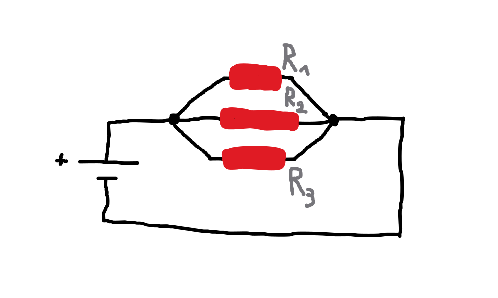

- Obsah
    - [Zapojení odporů](#zapojení-odporů)
        - [Sériové zapojení odporů](#sériové-zapojení-odporů)
        - [Paralelní zapojení odporů](#paralelní-zapojení-odporů)
- [Zdroje kapitoly](#zdroje-kapitoly)

### Zapojení odporů.

#### Sériové zapojení odporů.
- Odporové prvky jsou zapojeny za sebou na jednom vodiči.
- Všemi odpory protéká stejný elektrický proud, přičemž se napětí rozdělí mezi jednotlivé odpory.
- Celkový odpor obvodu je dán součtem všech jednotlivých odporů.

 

- Níže je uvedený příklad sériového zapojení odporů.

- Pro výpočet celkového odporu v elektrickém obvodu platí vztah:

$$
R = R_1 + R_2 + R_3
$$

#### Paralelní zapojení odporů.
- Jednotlivé odpory jsou zapojeny na různých větvích obvodu.
- S přibývajícími větvemi celkový odpor klesá, protože vzniká více cest, kudy může elektrický proud procházet.
- Převrácená hodnota celkového odporu se rovná součtu převrácených hodnot jednotlivých odporů.
- Převrácenou hodnotou odporu je elektrická vodivost.

 

- Níže je uvedený příklad paralelního zapojení odporů.

- Pro výpočet celkového odporu v elektrickém obvodu platí vztah:

$$
\frac{1}{R} = \frac{1}{R_1} + \frac{1}{R_2} + \frac{1}{R_3}
$$