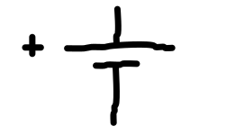

# Kapitola 3
Třetí kapitola popisuje činnost, využití a další informace o klíčových komponentech elektrického obvodu.

## Obsah kapitoly
- Obsah
    - [Zdroj](#zdroj)
    - [Spotřebič](#spotřebič)
- [Zdroje kapitoly](#zdroje-kapitoly)

## Komponenty elektrického obvodu

### Zdroj.
**Schématické značení**

- Elektrický proud teče z kladného pólu (+) k zápornému pólu (−).
- Napětí je orientováno opačně. Ze záporného pólu (−) ke kladnému pólu (+).

#### Spotřebič.
- Směr proudu na spotřebiči je stejný jako orientace napětí.

## Zdroje kapitoly
- [Youtube](https://youtube.com/)
    - [Názorná elektrotechnika](https://youtube.com/@nazornaelektrotechnika)
        - [Základy Elektrotechniky](https://youtube.com/playlist?list=PL3r1xGSQfP9TBwvTqYEf6E-L9duHQbnir)