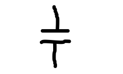

# Kapitola 3
Třetí kapitola popisuje činnost, využití a další informace o klíčových komponentech elektrického obvodu.

## Obsah kapitoly
- Obsah
    - [Zdroj](#zdroj)
    - [Spotřebič](#spotřebič)
- [Zdroje kapitoly](#zdroje-kapitoly)

## Komponenty elektrického obvodu

### Zdroj.
**Schématické značení**

- Elektrický proud teče z kladného pólu (+) k zápornému pólu (−).
- Napětí je orientováno opačně. Ze záporného pólu (−) ke kladnému pólu (+).

#### Spotřebič.
- Směr proudu na spotřebiči je stejný jako orientace napětí.

#### Kondenzátor.
**Schématické značení**

- Kondenzátor je pasivní součástka elektrického obvodu, která uchovává elektrický náboj.
- Skládá se ze dvou vodivých destiček, které se navzájem nedotýkají.

 

- Fyzikální veličinou charakterizující vlastnost kondenzátoru je kapacita. Jednotkou kapacity je farad.
- Standardní kondenzátory dosahují kapacity v řádech mikrofaradů. Kondenzátory s kapacitou v řádech jednotek se nazývají superkondenzátory.

 

- V vybitém stavu je kondenzátor elektricky neutrální, tudíž má na obou deskách stejný počet kladných a záporných nosičů elektrického náboje.
- Jakmile na jedné desce odebereme nebo přidáme jeden náboj, vznikne převaha.
- Na jedné desce dojde k převaze kladných nábojů - záporné jsou vytlačeny kladnými z druhé desky. A na druhé desce vznikne převaha záporných nábojů.

 

- Po odpojení od zdroje se náboje na deskách stále přitahují, tudíž je kondenzátor stále nabitý.
- Kondenzátor je nabit na takové napětí, které mu poskytne zdroj.
- Výstupní proud z kondenzátoru představuje navrácení kondenzátoru do elektricky neutrálního stavu. 

 

- Kapacitu kondenzátoru můžeme zvýšit třemi způsoby:
    - Zvětšením destiček kondenzátorů.
    - Přiblížením destiček kondenzátorů k sobě.
    - Vložením dielektrika.

## Zdroje kapitoly
- [Youtube](https://youtube.com/)
    - [Názorná elektrotechnika](https://youtube.com/@nazornaelektrotechnika)
        - [Základy Elektrotechniky](https://youtube.com/playlist?list=PL3r1xGSQfP9TBwvTqYEf6E-L9duHQbnir)
    - [ElectroBOOM](https://www.youtube.com/@ElectroBOOM)
        - [How CAPACITORS Work (ElectroBOOM101-006)](https://www.youtube.com/watch?v=rbCXKhhzBN0)
    - [Capacitors and Capacitance: Capacitor physics and circuit operation](https://www.youtube.com/watch?v=f_MZNsEqyQw)