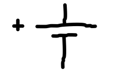
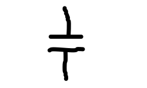
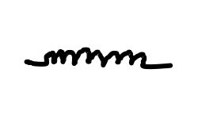

[:arrow_left: Základní pravidla](../kapitola_2/podkapitola_3.md)

[:arrow_right: Základy elektroniky](../kapitola_3/podkapitola_2.md)


# Komponenty elektrického obvodu
Třetí kapitola popisuje činnost, využití a další informace o klíčových komponentech elektrického obvodu.


## Obsah kapitoly
- Obsah
    - [Zdroj](#zdroj)
    - [Spotřebič](#spotřebič)
    - [Kondenzátor](#kondenzátor)
    - [Cívka](#cívka)
    - [Transformátor](#transformátor)
- [Zdroje kapitoly](#zdroje-kapitoly)


## Komponenty elektrického obvodu


### Zdroj
**Schématické značení**



- Elektrický proud teče z kladného pólu (+) k zápornému pólu (−).
- Napětí je orientováno opačně. Ze záporného pólu (−) ke kladnému pólu (+).

---


### Spotřebič
- Směr proudu na spotřebiči je stejný jako orientace napětí.

---


### Kondenzátor

**Schématické značení**



- Kondenzátor je pasivní součástka elektrického obvodu, která uchovává elektrický náboj.
- Skládá se ze dvou vodivých destiček, které se navzájem nedotýkají.

<br>

- Fyzikální veličinou charakterizující vlastnost kondenzátoru je kapacita. Jednotkou kapacity je farad.
- Standardní kondenzátory dosahují kapacity v řádech mikrofaradů. Kondenzátory s kapacitou v řádech jednotek se nazývají superkondenzátory.

<br>

- V vybitém stavu je kondenzátor elektricky neutrální, tudíž má na obou deskách stejný počet kladných a záporných nosičů elektrického náboje.
- Jakmile na jedné desce odebereme nebo přidáme jeden náboj, vznikne převaha.
- Na jedné desce dojde k převaze kladných nábojů - záporné jsou vytlačeny kladnými z druhé desky. A na druhé desce vznikne převaha záporných nábojů.
- U některých kondenzátorů, zejména elektrolytických, je nezbytné dodržovat správnou polaritu. Prohození polarity může způsobit chemické reakce uvnitř kondenzátoru, které mohou vést k jeho poškození nebo explozi.

<br>

- Po odpojení od zdroje se náboje na deskách stále přitahují, tudíž je kondenzátor stále nabitý.
- Kondenzátor je nabit na takové napětí, které mu poskytne zdroj.
- Výstupní proud z kondenzátoru představuje navrácení kondenzátoru do elektricky neutrálního stavu.

<br>

- Během nabíjení kondenzátoru napětí na jeho deskách postupně roste, zatímco proud procházející obvodem klesá.
- Při vybíjení kondenzátoru naopak napětí klesá a proud obvodem v počáteční fázi roste, dokud se kondenzátor nevybije.

<br>

- Kapacitu kondenzátoru můžeme zvýšit třemi způsoby:
    - Zvětšením destiček kondenzátorů.
    - Přiblížením destiček kondenzátorů k sobě.
    - Vložením dielektrika.

<br>

- Využití kondenzárotů:
    - Superkondenzátory se využívají jako zdroje s dlouhou životností a schopností dodávat velké proudy, ale mají nestabilní napětí.
    - Používají se pro konstantní náběhy, které trvají určitý časový úsek.
    - Kondenzátory se také používají pro vyhlazování stejnosměrného proudu, což zlepšuje stabilitu napájecích obvodů.
    - Jsou vhodné tam, kde je potřeba krátkodobý vysoký proud, například v aplikacích s nízkým stálým proudem, ale vysokými špičkovými proudovými nároky.

<br>

- Energie kondenzátoru je dána vztahem:

$$
E = \frac{C \cdot U^2}{2}
$$

```
E = energie uložená v kondenzátoru (J)
C = kapacita kondenzátoru (F)
U = napětí na kondenzátoru (V)
```

---


### Cívka

**Schématické značení**



- Cívka je vodič navinutý do spirály, který umožňuje průchod proudu a vytváří magnetické pole uvnitř sebe i ve svém okolí.
- Většina cívek je spojena s jádrem (často železným), které zvyšuje magnetický tok a umožňuje dosažení silnějšího magnetického pole při menším proudu.
- Rychlé odpojení cívky od zdroje může způsobit elektrický výboj v důsledku kolapsu magnetického pole.
- Díky své schopnosti vytvářet proud indukcí má cívka tzv. vlastní indukčnost.

<br>

- Cívka brání prudkým změnám proudu, protože nárůst proudu probíhá určitou dobu.
    - Po sepnutí obvodu s cívkou napětí na cívce začíná na své maximální hodnotě a postupně klesá, zatímco proud se postupně zvyšuje.
    - Při vypnutí obvodu proud klesá z maximálních hodnot na nulu.

<br>

- Cívka indukuje napětí pouze při změně magnetického pole, tedy při změně směru (průběh střídavého proudu) nebo intenzity proudu (vypnutí a zapnutí obvodu).
- Energie uložená v cívce se vypočítá podle následujícího vzorce:

$$
E = \frac{L \cdot I^2}{2}
$$

```
E = energie (J)
L = indukčnost (H)
I = elektrický proud (A)
```

<br>

- Vzájemná indukčnost popisuje vztah mezi dvěma cívkami, které mohou částečně sdílet své magnetické toky.
- Část magnetického toku, kterou cívky sdílí, se označuje jako rozptylový tok.

<br>

**Využití**

<br>

- Cívky se využívají k ukládání energie pomocí magnetického pole.
- Cívky pomáhají eliminovat elektrický šum a přepěťové špičky v obvodech.
- Elektromagnet je cívka s železným jádrem, které zesiluje magnetické pole.
- Spojením dvou cívek lze vytvořit transformátor, který umožňuje přenos napětí a proudu mezi obvody – tento princip je využíván například v zařízeních jako tasery či zapalovací cívky.

---


### Transformátor
- Transformátor slouží ke změně hodnot napětí a proudu při zachování výkonu.
- Typický transformátor se skládá ze dvou nebo více vinutí (primárního a sekundárního), která jsou umístěna na společném železném jádře. Železné jádro zajišťuje, že magnetický tok je co nejvíce sdílen mezi oběma vinutími.
- Vinutí nejsou elektricky propojena. Elektrický výkon je přenášen prostřednictvím elektromagnetické indukce: střídavý proud v primárním vinutí vytváří časově proměnné magnetické pole, které indukuje napětí ve vinutí sekundárním.
- Transformátory tudíž fungují pouze se střídavým proudem, protože pro přenos energie je nutná změna magnetického toku.
- Přenos výkonu mezi primárním a sekundárním vinutím se řídí zákonem zachování energie, takže platí vztah:

$$
P_1 = P_2
$$

- Z tohoto vztahu vyplývá, že součin napětí a proudu je na primární i sekundární straně stejný:

$$
U_1 \cdot I_1 = U_2 \cdot I_2
$$

- Poměr napětí, proudu a počtu závitů vinutí lze vyjádřit vztahem:

$$
\frac{U_1}{U_2} = \frac{I_2}{I_1} = \frac{N_1}{N_2}
$$

```
P_1, P_2 = zdánlivý výkon (VA)
U_1, U_2 = elektrické napětí (V)
I_1, I_2 = elektrický proud (A)
N_1, N_2 = počet závitů vinutí
```

<br>

- Vinutí, kterým prochází větší proud, je obecně vyrobeno z tlustšího drátu, aby vydrželo vyšší proudovou zátěž a tím i tepelné namáhání.


## Zdroje kapitoly
- [Youtube](https://youtube.com/)
    - [Názorná elektrotechnika](https://youtube.com/@nazornaelektrotechnika)
        - [Základy Elektrotechniky](https://youtube.com/playlist?list=PL3r1xGSQfP9TBwvTqYEf6E-L9duHQbnir)
    - [ElectroBOOM](https://www.youtube.com/@ElectroBOOM)
        - [How CAPACITORS Work (ElectroBOOM101-006)](https://www.youtube.com/watch?v=rbCXKhhzBN0)
    - [Capacitors and Capacitance: Capacitor physics and circuit operation](https://www.youtube.com/watch?v=f_MZNsEqyQw)

---


[:arrow_left: Základní pravidla](../kapitola_2/podkapitola_3.md)

[:arrow_right: Základy elektroniky](../kapitola_3/podkapitola_2.md)